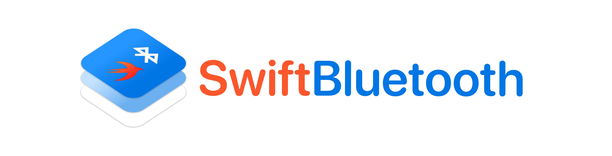

Easily interface with Bluetooth peripherals in new or existing projects through modern async Swift API's.

[](https://swiftpackageindex.com/exPHAT/SwiftBluetooth)
[](https://swiftpackageindex.com/exPHAT/SwiftBluetooth)


## Features

- [x] Parity with existing `CoreBluetooth` APIs for easy, incremental migration of existing projects
- [x] Modern, async-await API for discovery, connection, read/write, and more
- [x] Alternate callback-based API for codebases not using Swift Concurrency
- [x] Subscribe to peripheral discoveries, value updates, and more through `AsyncStream`
- [x] Easy await-ing of `CentralManager` state
- [x] Staticly typed characteristics
- [x] Thread safe
- [x] Zero inherited dependencies
- [x] Tested with included `SwiftBluetoothMock` library
- [ ] SwiftUI support

## Examples

[API Documentation.](https://swiftpackageindex.com/exPHAT/SwiftBluetooth/1.0.0/documentation/)

#### Complete example

Async API's make the entire Bluetooth lifecycle much simpler, using method names you're already familiar with from CoreBluetooth.

```swift
import SwiftBluetooth

let central = CentralManager()
try await central.waitUntilReady()

// Find and connect to the first available peripheral
let peripheral = await central.scanForPeripherals(withServices: [myService]).first!
try await central.connect(peripheral, timeout: connectionTimeout)

// Discover services and characteristics
let service = try await peripheral.discoverServices([myService]).first(where: { $0.uuid == myService })!
let _ = try await peripheral.discoverCharacteristics([.someCharacteristic], for: service)

// Read data directly from your characteristic
let value = try await peripheral.readValue(for: .someCharacteristic)

central.cancelPeripheralConnection(peripheral)
```

#### Callbacks

Most of the stock CoreBluetooth methods now have an additional new signature that takes a completionHandler in case you're not using Swift Concurrency.

```swift
central.connect(peripheral) { result in
  if result == .failure(let error) {
    // Issue connecting
    return
  }

  // Connected!
}
```
> Methods often now have 3 overloads. One marked `async`, one with a `completionHandler`, and the stock CoreBluetooth verision. Meaning you can choose whichever is most convienient.

#### Stream discovered peripherals

Many operations (like scanning) conform to `AsyncStream`, meaning you can use for-await-in loops to iterate over new items.

```swift
let central = CentralManager()
try await central.waitUntilReady()

for await peripheral in await central.scanForPeripherals() {
  print("Discovered:", peripheral.name ?? "Unknown")
}
```

#### Defining characteristics

Characteristics can be staticly defined on the stock `Characteristic` type, which removes the burden of keeping track of `CBCharacteristic` instances around your app.

```swift
extension Characteristic {
  static let someCharacteristic = Self("00000000-0000-0000-0000-000000000000")
}

// Use those characteristics later on your peripheral
try await myPeripheral.readValue(for: .someCharacteristic)
```


#### Watching with callbacks

Peristent tasks return a `CancellableTask` that needs to be cancelled when you're done.

```swift
let task = central.scanForPeripherals { peripheral in
  print("Discovered:", peripheral.name ?? "Unknown")
}

// At some point later, cancel the task to stop scanning
task.cancel()
```
> **Note**
Calling `central.stopScan()` will also cancel any peripheral scanning tasks

#### Migrate existing projects

Existing projects that already use `CoreBluetooth` can immediately get started by typealiasing the stock types. Afterwards, you can adopt async API's at your own pace.

```swift
import CoreBluetooth
import SwiftBluetooth // Add this

// Override existing CoreBluetooth classes to use SwiftBluetooth
typealias CBCentralManager         = SwiftBluetooth.CentralManager
typealias CBCentralManagerDelegate = SwiftBluetooth.CentralManagerDelegate
typealias CBPeripheral             = SwiftBluetooth.Peripheral
typealias CBPeripheralDelegate     = SwiftBluetooth.PeripheralDelegate

// Your existing code should continue to work as normal.
// But now you have access to all the new API's!
```


## Install

#### Xcode

Add `https://github.com/exPHAT/SwiftBluetooth.git` in the ["Swift Package Manager" tab.](https://developer.apple.com/documentation/xcode/adding-package-dependencies-to-your-app)


#### Swift Package Manager

Add SwiftBluetooth as a dependency in your `Package.swift` file:

```swift
let package = Package(
  ...
  dependencies: [
    // Add the package to your dependencies
    .package(url: "https://github.com/exPHAT/SwiftBluetooth.git", branch: "master"),
  ],
  ...
  targets: [
    // Add SwiftBluetooth as a dependency on any target you want to use it in
    .target(name: "MyTarget",
            dependencies: [.byName(name: "SwiftBluetooth")])
  ]
  ...
)
```
